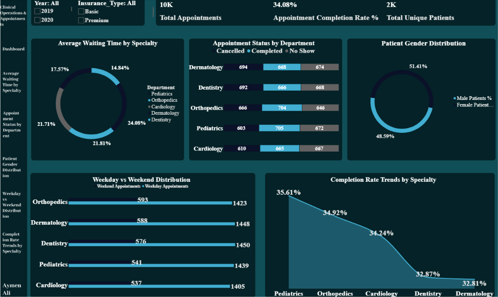
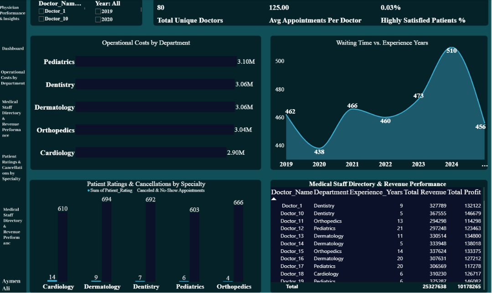

# 🏥 Healthcare Intelligence & Performance Analytics Dashboard

## 📌 Project Overview   
# 🏥 Healthcare Business Intelligence Dashboard

A comprehensive, interactive, and dark-themed Business Intelligence solution designed to analyze clinical, operational, and financial healthcare data. Built with a cinematic, high-contrast user interface to ensure optimal scannability, this dashboard empowers healthcare executives and clinic managers to discover critical insights and drive data-backed operational improvements.

---

## 🚀 Project Overview

This analytics project delivers a 360-degree view of medical facility operations by breaking down complex datasets into three highly focused strategic pillars:
1. **Financial Performance:** Monitoring revenue generation, gross profits, and profit margins across geographical regions and insurance tiers.
2. **Physician Performance:** Evaluating doctor utilization rates, operational costs per specialty, and tracking patient satisfaction metrics against cancellations.
3. **Clinical Operations:** Analyzing appointment fulfillment cycles, patient gender distributions, and average waiting times to optimize clinic throughput.

---

## 📊 Dashboard Views & Pages

### 1️⃣ Financial Performance Overview
This view highlights critical financial KPIs, annual revenue/margin trends, and deep dives into which medical specialties or insurance plans drive the most profitability.

* **Key Metrics:** $25\text{M}$ Total Revenue, $10\text{M}$ Total Profit, and a $40.19\%$ Profit Margin.
* **Preview:**

---

### 2️⃣ Physician Performance & Insights
Designed for clinical operational leaders, this page maps out department-specific operational costs, compares a doctor's years of experience against patient waiting times, and audits revenue performance per staff member.

* **Key Metrics:** Highlights Pediatrics and Dentistry as highest operational cost centers, alongside full staff performance matrices.
* **Preview:**

---

### 3️⃣ Clinical Operations & Appointments
A detailed analytical space mapping out scheduling efficiency, visualizing appointment status breakdowns (Completed vs. Canceled vs. No-Show), and uncovering weekday vs. weekend distribution trends.

* **Key Metrics:** $10\text{K}$ Total Appointments, $34.08\%$ Appointment Completion Rate, and clear gender distribution trends.
* **Preview:**

---

## 🛠️ Tech Stack & Skills Demonstrated

* **Data Modeling & DAX:** Advanced data modeling, relationships, and calculated time-intelligence measures using **Microsoft Power BI**.
* **UI/UX Design:** Custom glassmorphic containers, structured navigation layouts, and rounded-corner cards built in **Figma** to achieve a premium, dark-themed dashboard container.
* **Data Prep:** Structuring relational schemas (fact and dimension tables) ready for production environments.

---

## 📈 Key Interactive Features

* 🎛️ **Cross-Filtering & Slicers:** Seamlessly filter the entire dataset by Year, City, Insurance Type, or Medical Specialty.
* 🎨 **Cinematic Dark Mode UI:** High contrast ratios to prioritize data scannability at a glance without visual fatigue.
* 📈 **Trend Analysis:** Clear dual-axis line charts tracking historical margins alongside revenue growth (YoY/MoM).

---
💼 **Business Intelligence Dashboard**

## 👨‍💻 Author

Aymen Ali

Data Analyst | Power BI Developer | Business Intelligence Enthusiast

---

## ⭐ If you found this project helpful, don't forget to Star the repository.

